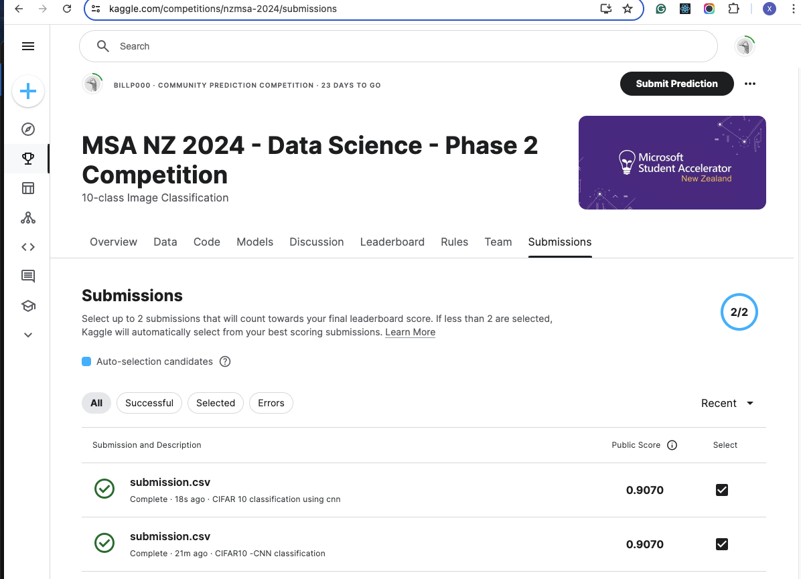

# msaphase2
## 1. Azure SQL online studying
screenshot: https://www.awesomescreenshot.com/image/48942183?key=1bfb6bfbcd31efc3a34603262c98b1aa

## 2. Data Science tasks
### Part 1: Load and preprocess data
script: [part1-submission.ipynb](./part1-submission.ipynb)  
PDF report: [part1-submission.pdf](./part1-submission.pdf)

### Part 2: Modeling and evaluation
script: [part2-submission.ipynb](./part2-submission.ipynb)  
PDF report: [part2-submission.pdf](./part2-submission.pdf)

### Part 3: Deep neural network
script: [part3-submission.ipynb](./part3-submission.ipynb)  
PDF report: [part3-submission.pdf](./part3-submission.pdf)
trained model: cifar_cnn.h5
#### Kaggle competition
**account name:** Jackreckness83  
